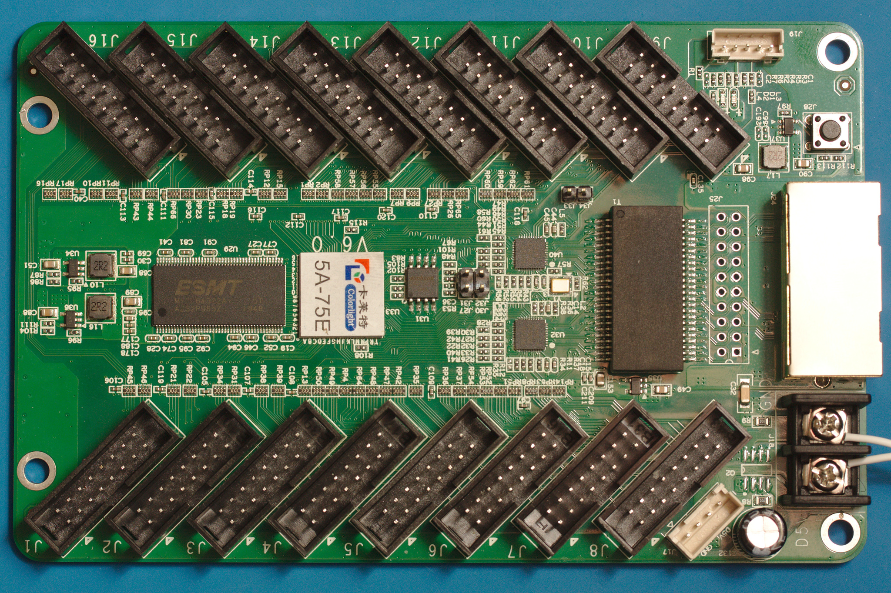
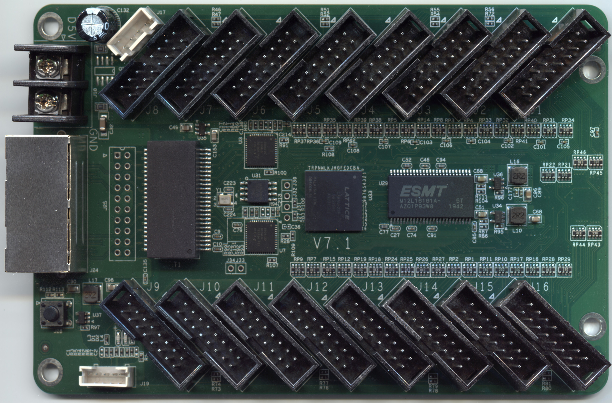
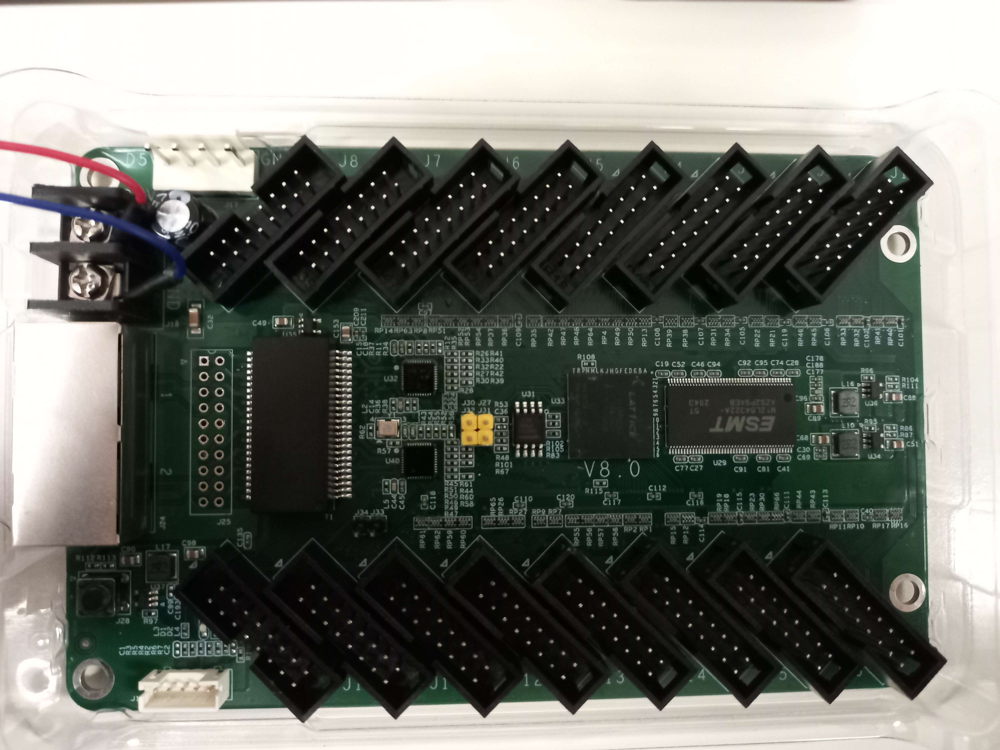

# Colorlight 5A-75E on IoB-SoC

## Revisions
This board has 3 different revisions:
- `6.0` ([hardware information](./hardware_V6.0.md))
    - 
- `7.1` ([hardware information](./hardware_V7.1.md))
    - 
- `8.0` ([hardware information](./hardware_V6.0.md))
    - 

## PIN constraints

In case you want to add/remove/change design's pin constraints, you need to add them (for your specific revision) inside [`pin_constraints.tcl`](../pin_constraints.tcl) source file.

The existing code example should help and be clear enough.

## Reference
All board information was obtained from [q3k/chubby75](https://github.com/q3k/chubby75).
