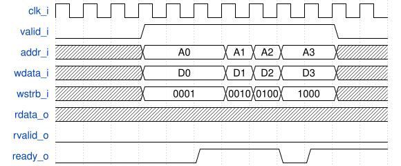

# IOb-interface

The IOb-interface has the following signals:
- `clk_i`: interface clock
- `valid_i`: source signal valid transaction
- `addr_i`: address for access
- `wdata_i`: data to write
- `wstrb_i`: write strobe
- `rdata_o`: read data
- `rvalid_o`: valid read data
- `ready_o`: destination ready to accept transactions

Transactions occur when both `valid_i` and `ready_o` are HIGH for one `clk_i`
period.

Use `wstrb_i` to distinguish between READ and WRITE operations. READ operations
occur when all `wstrb_i` bits are LOW.

## Read Transaction
For READ operations: when `valid_i` and `ready_o` are HIGH, read `addr_i`
address. The `rdata_o` is available when `rvalid_o` is HIGH.

## Write Transaction
For WRITE operations: when `valid_i` and `ready_o` are HIGH, write `wdata_i`
bytes with corresponding `wstrb_i` bit HIGH to `addr_i` address.

